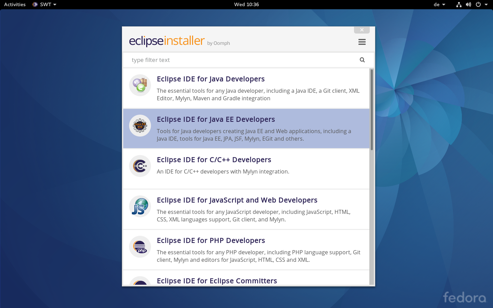
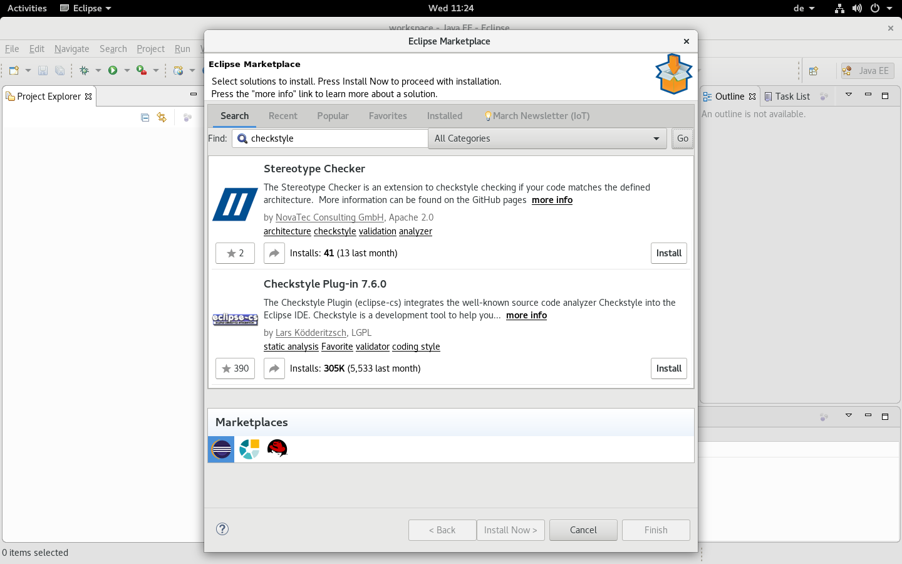
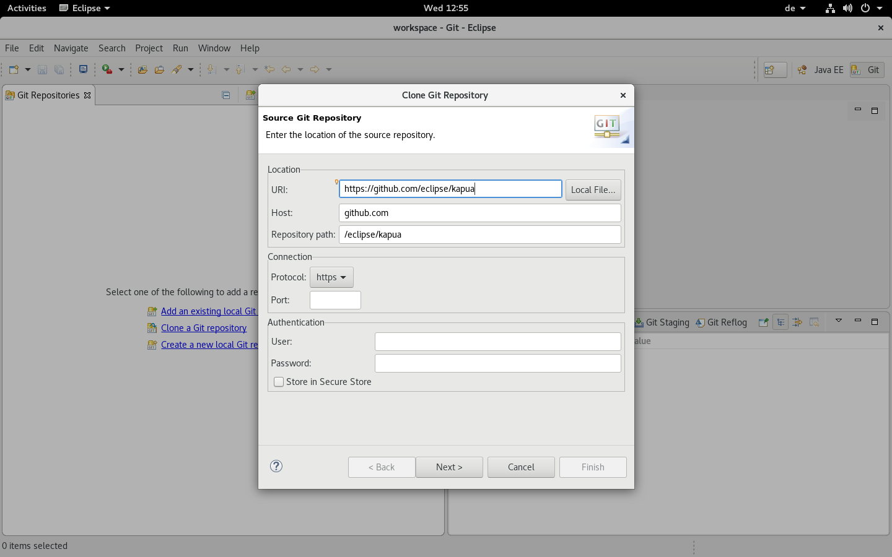
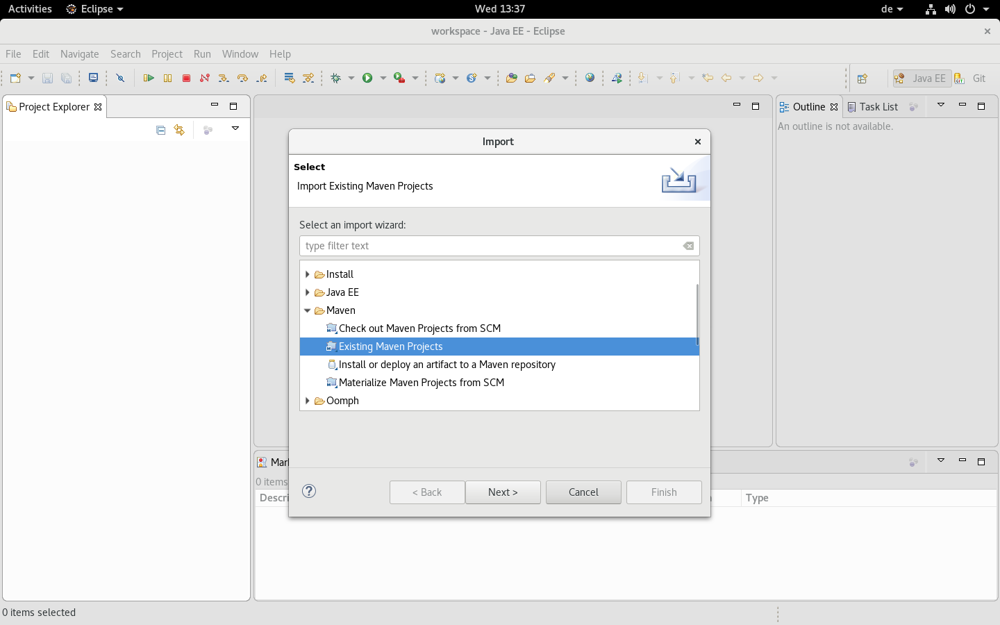
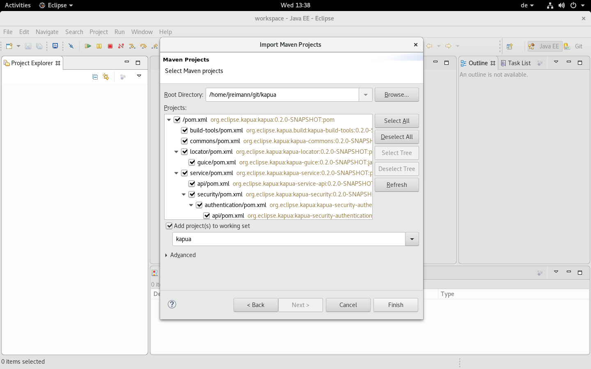
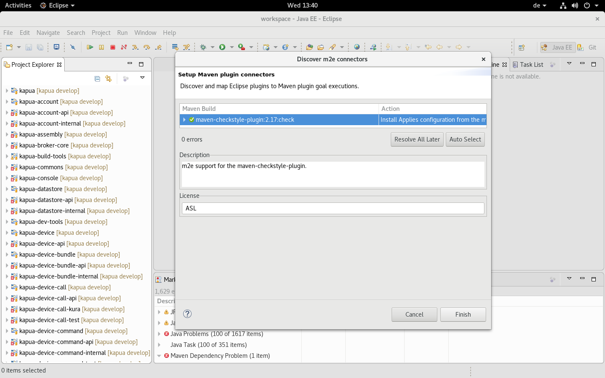
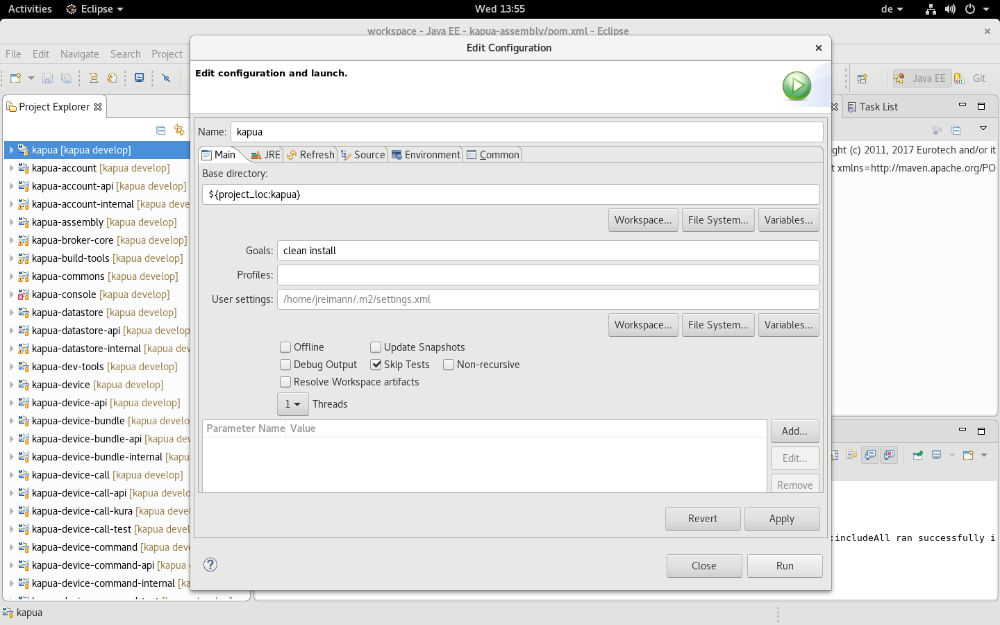
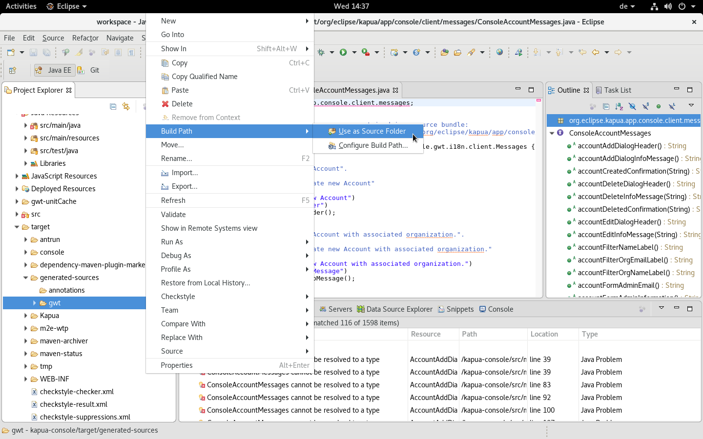

# IDE support

Kapua uses a standard Maven setup for building. So it should be possible to
work on Kapua with any IDE.

The following sections describe ways to set up different IDEs to work best with Kapua.

## Eclipse - manual setup

As a pre-requisite you will need:

* Java 8 with the JDK installed on your local machine
* A working internet connection

The following steps have to be performed

### Download and install the Eclipse IDE

The Eclipse IDE can be either downloaded as a package from
<https://www.eclipse.org/downloads/eclipse-packages/> or it can
be installed using the Eclipse Installer.


As of now the current version of Eclipse is "Neon". It should be
possible to use future versions of Eclipse in the same way, but
this guide focuses on "Eclipse Neon.3".


Either way you will have the possibility to choose which edition of the
Eclipse IDE you would like. While it is possible to extend any edition
of Eclipse with additional plugins to feature the same functionality, it
is recommended to start with the "Eclipse IDE for Java EE Developers" as it
already contains most plugins supporting the development already.

After the Eclipse IDE has been installed or extracted (depending on
the method of installation) start it up with a new, empty workspace.

If you already have a working Eclipse IDE installation it is also possible
to re-use this. You can run the same instance with multiple workspaces.

### Install additional plugins

There is a set of plugins for the Eclipse IDE which help in the development
process. And while they are not required, it is recommended to install them
in order to simplify the development process.

Those plugins have to be installed **before** importing the source code into the
Eclipse workspace, as they won't get activated properly for each project otherwise.

Kapua uses a plain Maven setup and this does not make use of checked in project
configurations. However the Maven integration of Eclipse can detect settings from
Maven plugins and configure Eclipse to behave in the same way, re-using the Maven
configuration. But for this to work, it is best to install extension plugins
before the initial import of the Kapua source code into the workspace.

Some of the following plugins can be installed from the
[Eclipse Marketplace](https://marketplace.eclipse.org/) or, when viewing this
documentation as HTML, by dragging the install buttons below directly onto the
Eclipse IDE window:

 

<dl>

<dt>EclEmma</dt>
<dl>

EclEmma is a plugin that can analyze code coverage when running unit tests.

<dl>

<dt>Eclipse Checkstyle Plugin</dt>
<dl>

Kapua uses checkstyle during the build to ensure that some common pitfalls are detected during the build. This plugin
will show those errors already in the IDE once the file is saved.

<dl>

<dt>YEdit</dt>
<dl>

YEdit is a YAML editor for Eclipse. It can help to edit the different YAML files which Kapua uses.

<dl>

</dl>

### Check out from GitHub

Eclipse Kapua is hosted in the GitHub repository [eclipse/kapua](https://github.com/eclipse/kapua). There are different
ways to clone repositories from GitHub (HTTPS, SSH, direct, forked) the following sections assume that you are
cloning a direct copy using HTTPS. For this the URL is `https://github.com/eclipse/kapua.git`.

Switch to the Eclipse Git perspective and create a new clone from the URL above. Use the `develop` branch for
the most recent development.

 

### Importing projects

After the repository has been cloned switch back to the "Java EE" perspective, right click in the
empty "Project Explorer" view and select "Import…".

Browse to the location where you cloned the Git repository to and select the directory.

The actual import process may take a few minutes as required artifacts
will be downloaded from Maven Central and the Eurotech Maven repository.

Finally a dialog might ask you to install additional Maven connectors, allow it to install necessary/missing
connectors so that they are available in the Eclipse IDE and configuring the newly imported projects.
This process may ask you to restart the Eclipse IDE instance. In this case answer "yes", the import
process will continue after the restart. Be sure to give the process a bit of time after the restart.

### Initial build

In order to fix errors on the `kapua-console` project you will need
to run a full build on the project. Right click on the `kapua` project
and select "Run as" -> "Maven build…". In the following dialog enable the
checkbox to skip tests and press "Run".

The initial build will take again a few minutes. Afterwards refresh the
`kapua-console` project (e.g. by selecting and pressing "F5").

Add the `target/generated-sources/gwt` to the build path of the
project:

