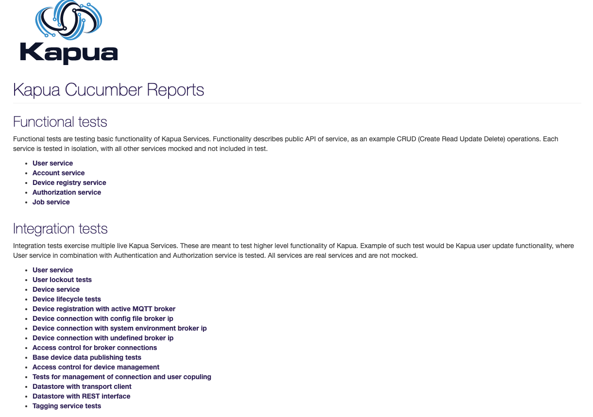

# Kapua QA process

This chapter describes a quality assurance process of Kapua. Before you commit changes to the `develop` branch, be sure that you have followed those steps:

1. Run `mvn clean install -DskipTests -Pconsole,docker` and then `mvn clean install` command to see if all the tests pass correctly
2. Push changes to you remote repository and wait for the CI to complete successfully (there should be no test failures, CI environments should always be green):
	- GitHub Actions CI  

## Cucumber Specifics In Kapua project

Before you dive deeper into this document, you should have basic knowledge of java, maven, BDD (Behaviour Driven Development), understading of basic QA processes and what is the difference between Unit, integration and all other types of tests. Basic descriptions are bellow, but it is always good to have deeper understanding of testing procedures. There are links to external websites for every topic, so you can check out specifics if you need/want to.

Usefull links:
 - [Unit testing explained](http://softwaretestingfundamentals.com/unit-testing/)
 - [Types of tests explained in 5 minutes](https://www.geeksforgeeks.org/types-software-testing/)
 - [Integration vs. Functional testing](https://codeutopia.net/blog/2015/04/11/what-are-unit-testing-integration-testing-and-functional-testing/)
 - [Cucumber 10 minute tutorial](https://cucumber.io/docs/guides/10-minute-tutorial/)
 - [Maven explained](https://maven.apache.org/guides/getting-started/maven-in-five-minutes.html)

### Prerequisites (Java, Maven, Cucumber)
If you are already using Kapua, you can jump straight to section 4), otherwise follow the steps 1), 2) and also 3). These steps are also described in other documents (and Internet), but we are adding them nevertheless. 

1) Download And Install IDE (This tutorial uses IntelliJ)

Go to [IntelliJ website](https://www.jetbrains.com/idea/download/download-thanks.html?platform=mac) and download the Community Edition IntelliJ. After the installation, we have to install some plugins also, but not before we install Java and Maven.

2) Installing Java

Go to [Java official website](https://www.oracle.com/technetwork/java/javase/downloads/jdk8-downloads-2133151.html) and download Java SE Development Kit 8u211. After the installation check if java has been successfully installed by typing "java -v" in terminal. 

3) Installing Maven

Now that we have IDE and JDK, we still need Maven. Go to [official Maven website](https://maven.apache.org/download.cgi), select the proper package (it can either ZIP archive or tar.gz archive). Click on download link and save the file (to e.g. Desktop) and after that unzip it to a specific folder in the directory structure (you should never move or delete this maven file once is in this place). An example path is "/opt/apache-maven-3.5.0." 
When the file is in place, we have to add its path to "PATH" environmental variable. Open Terminal and type: "export PATH=$PATH:~/opt/apache-maven-3.5.0"
Verify that maven is in place with "mvn -v" command in terminal.

4) Configuring Cucumber (pom.xml files, plugins)

When you have your IDE, Java and Maven, it is time to setup plugins. As said in the beginning, this tutorial uses IntelliJ, but this can all be achieved on Eclipse IDE also (plugin names are a bit different).
In IntelliJ, go to Preferences -> Plugins -> Marketplace. Search an install the following plugins:
 - Cucumber for Java
 - Gherkin (**Do not install "Substep IntelliJ plugin" as it will interfere with other two and Cucumber syntax will not be recognized.**) 
 
 After this is achieved, you have everything that you need to start writing your own tests.

5) Cloning Kapua project

Final step is to clone Kapua from GitHub repository. This is done with command "git clone https://github.com/eclipse/kapua.git ".

### Testing In General

#### Unit testing
Unit testing is simple testing, that tests small chunks of code (for example user creation), that do not use other services (permissions, devices...). These tests are tipically done by developers as they know the functionality best.

#### Integration testing
These tests do not test one method at a time, but rather try to simulate a real scenario (user creation, adding permissions, deleting user...). This way we test multiple services/methods/pieces of code so we can see, if the code behaves as it should. Integration tests are usually written by QA engineers. 

#### Cucumber testing
Cucumber tests use Gherkin syntax to simulate functional tests. This are not »pure« integration tests, but the similarities are obvious: Code is tested through various scenarios to check if it works as intended. Cucumber has two important components: so called ».feature« files and »steps« files. In ».feature« files we have all the scenarios written in Gherkin syntax and in »steps« files we have implementation of these steps from feature files. This way the code in ».feature« files is easily readable, can be written virtually by anyone and can be easily changed. 

#### Cucumber General Settings
Every project that uses Cucumber as framework for integration testing, needs some specifics inside pom.xml files. All of these settings can be found on the websites listed bellow. 

##### Kapua Specifics
Kapua project has integration and some unit tests written in cucumber. The biggest difference is the location of these tests. Because Unit tests are isolated tests and do not need "external" components, they are located in:

 - "Service" folder. In test-steps subfolder there are also "steps" files, that contain implementation from ".feature" files - but more on this later.

```
{
  Service
  	Account
  		test
  			src
  				java
  					org.eclipse.kapua-service.account.test
  						CucumberWithPropertiesForAccount
  						RunAccountUnitTest
  					resources 
  						features
  							AccountService.feature
  		test-steps
  			src
  				main
  					java
  						org.eclipse.kapua.service.account.steps
  							AccountServiceSteps
}
```

On the other hand, we have "qa" folder, that contains ".feature" files for integration tests (see code tree bellow). As stated above, there is "test-steps" folder in "Service" part of the code. This is because of Unit tests, that need all the steps in their package, but we can easily access to them from qa folder as well. This way we do not have two "test-steps" files but only one.

 - qa root folder (".feature" files of integration tests)
 - service root folder ("test-steps" files - see the code tree above).

```
{
  QA
  	integration
  		src
  			test
  				Resource
  					features
  						account
  						authorization
  						broker
  						.
  						.
  						.
}
```

Besides these two files (".feature" and "steps" files), there is another one, that is crucial for running a cucumber integration test - Run<"service-name">I9nTest. These scripts contain Cucumber options (feature files, "glue" files, used plugins etc), that are crucial for running the tests. As we have stated before, Cucumber tests are functional tests and because of this they need additional methods and classes so this file provides everything that the tests need, to be properly executed.

```
{
  qa
  	integration
  		src
  			test
  				java
  					org.eclipse.kapua.integration
  						misc
  						rest
  						service
  							account
  								RunAccountServiceI9nTest
  							authorization
  							connection
  							datastore
  							datastreJunit
  							device
  							job
  							user
  						
}
```

One example of these file is shown bellow:

```
{
@RunWith(CucumberWithProperties.class)
@CucumberOptions(
        features = {
                "classpath:features/user/UserServiceI9n.feature",
                "classpath:features/user/UserRoleServiceI9n.feature"
        },
        glue = {"org.eclipse.kapua.qa.common",
                "org.eclipse.kapua.service.account.steps",
                "org.eclipse.kapua.service.user.steps",
                "org.eclipse.kapua.service.authorization.steps"
        },
        plugin = {"pretty", 
                  "html:target/cucumber/UserServiceI9n",
                  "json:target/UserServiceI9n_cucumber.json"
                 },
        strict = true,
        monochrome = true)
@CucumberProperty(key="broker.ip", value="192.168.33.10")
@CucumberProperty(key="kapua.config.url", value="")
@CucumberProperty(key="datastore.elasticsearch.provider", value="org.eclipse.kapua.service.elasticsearch.client.rest.RestElasticsearchClientProvider")
@CucumberProperty(key="org.eclipse.kapua.qa.datastore.extraStartupDelay", value="5")
@CucumberProperty(key="org.eclipse.kapua.qa.broker.extraStartupDelay", value="5")
public class RunUserServiceI9nTest {}
```
}

##### POM.xml file
The root POM.xml file includes all the dependencies, plugins and properties regarding Cucumber needed for running Cucumber tests. Bellow there are snippets from POM.xml file, that are relevant for our functional testing. 


```
{
<dependency>
	<groupId>info.cukes</groupId>
	<artifactId>cucumber-core</artifactId>
</dependency>
```
}

```
}
<dependency>
<groupId>info.cukes</groupId>
<artifactId>cucumber-java</artifactId>
<version>${cucumber.version}</version>
</dependency>
```
}

```
}
<dependency>
<groupId>info.cukes</groupId>
<artifactId>cucumber-junit</artifactId>
<version>${cucumber.version}</version>
</dependency>
```
}

```
}
<dependency>
<groupId>info.cukes</groupId>
<artifactId>cucumber-guice</artifactId>
<version>${cucumber.version}</version>
</dependency>
```
}


Inside org.apache.maven.plugins plugin there has to be Cucumber listed: 
```
            <plugin>
                <groupId>org.apache.maven.plugins</groupId>
                .
                .
                .
                    <argLine>@{argLine} -Xmx1024m</argLine>
                    <systemPropertyVariables>
                        <cucumber.options>--tags ~@rest</cucumber.options>
                        .
                        .
                        .
                    </systemPropertyVariables>
                </configuration>
            </plugin>
```

In ```<properties>```: 
<cucumber.version>1.2.4</cucumber.version>

### Running the (integration) tests
Bellow there is a sample command, which is used to run the tests. 

```
mvn verify -Dcommons.db.schema=kapuadb -Dcommons.settings.hotswap=true -Dbroker.host=localhost -Dgroups='!org.eclipse.kapua.qa.markers.junit.JUnitTests' -Dcucumber.options="--tags ~@rest"
```

First part is clear: mvn verify command runs any integration tests that maven finds in the project. 
Parameters that follow (kapuadb, hotswap and broker) are neccessary options for all the tests and after that we have options for the tests themselves.

Bottom command specifies that JUnit tests should (in this specific case) not be run:

```
-Dgroups='!org.eclipse.kapua.qa.markers.junit.JUnitTests'
```

And the last part of the command (see bellow) specifies that Rest tests should also be skipped. All other tests will start when executing this command.

```
-Dcucumber.options="--tags ~@rest"
```

### Cucumber reports
After every exceution of cucumber integration tests, there is a test report generated, that is located in /dev-tools/cucumber-reports/target.
Every service has its own folder, so if all the integration tests are run, there should be structure as shown bellow: 

```
dev-tools
	cucumber-reports
    	target
        	kapua-cuucmber-report
            	account-service
                broker-ACL-i9n
                connection-user-coupling-i9n
                datastore-rest-i9n
                datastore-transport-i9n
                device-broker-i9n
                device-data-i9n
                device-lifecycle-service-i9n
                device-manager-ACL-i9n
                device-registry-service
                device-service-i9n
                job-service
                tag-service
                user-service
                user-service-i9n
                user-service-lockout-i9n
```

Every folder should contain the following files:
 - formatter.js
 - index.html
 - jquery-1.8.2.min.js
 - report.js
 - style.css

If you open root index.html file (located in /dev-tools/cucumber-reports/target) with your preferable browser, main page of cucumber reports will open (screenshot bellow).



From here you can navigate to any of the specific reports - bellow there is a sample screenshot of a page like this, where you can see all the details for every test. 

