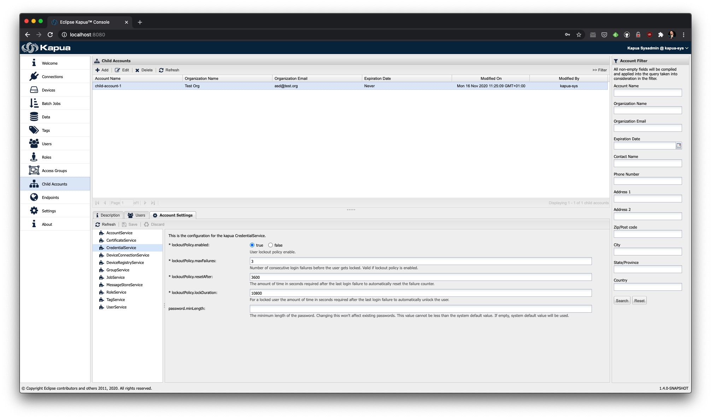

Credentials
==========

Any **User** can have **Credentials** of two types: `API_KEY` and `PASSWORD`.

An `API_KEY` credential consists of a random generated string, and will be shown only once during creation, so make sure
to write it down and keep somewhere safe as there will be no way to retrieve it. It can be used instead of the standard
`PASSWORD` **Credential** to perform a REST API login via the `/authentication/apikey` resource.

A `PASSWORD` credential is a standard password that is assigned to a **User**; only one `PASSWORD` **Credential** can
be assigned to a single **User**. By default, it must be at least 12 characters long and contain at least one uppercase
letter, one lowercase letter, one number and one symbol; however, a different minimum can be enforced both at account
level and at system level.

In order to set a different limit for a specific account, go to the `Child Accounts-->Settings` panel in the Console
and look for the `CredentialService` settings:

The `password.minLength` configuration value can be changed to enforce a different minimum length for new passwords;
existing passwords won't be affected by the change of the value. Allowed values are numbers between `12` and `255`
inclusive, or an empty value (default); in this case, the default system value will be used. In order to set the default
system value, use the `authentication.credential.userpass.password.minlength` system property; again, the allowed values
are numbers between `12` and `255` inclusive, with `12` being the default if no value is set. Setting a value lower than
`12` or higher than `255` will have the system reject the desired value and use `12` or `255` respectively.
