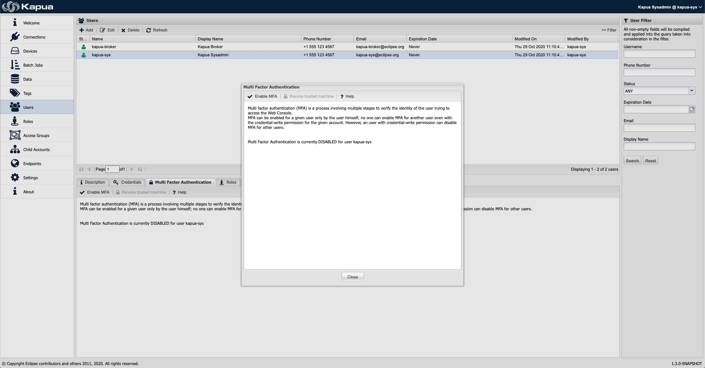
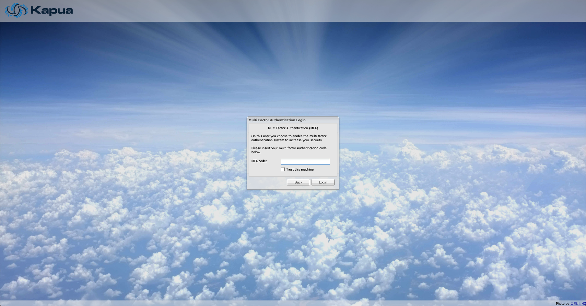

# Multi Factor Authentication

Kapua provides a Multi Factor Authentication feature (a.k.a. MFA), which allows a user to authenticate to a system only when he presents the 
password and another valid factor. A user can enable the MFA through the User menu in the Console.

The user can also access the MFA configuration dialog through the upper right menu. Note that only the user itself can enable the MFA.

MFA uses a secret to produce a one-time code to authenticate. The secret will be displayed in the form of a QR code during the MFA activation. 
This QR code can only be viewed once during MFA activation, and only by the user itself. To collect the QR code, use an authenticator app 
(e.g. the Google Authenticator App) installed on a smartphone. This app will be used to produce one-time authentication code.

Scratch codes are also produced, in order to pass the multi factor authentication in case the authenticator app is temporarily unavailable. 
Similarly to the QR code, also scratch codes can only be viewed once during MFA activation, and they can be viewed only by the user itself. 
Users have a limited number of scratch codes (the maximum number of scratch codes can be set through a dedicated environment variable, see the Web 
Console container properties section for more information). Furthermore, each scratch code is invalidated after being used once.

The admin is able to see if the user have the MFA enabled or not. Moreover, even if only the user is allowed to enable MFA, the admin is allowed to disable 
it for each one of the users in the account.

When the MFA is enabled for a given user, such user has to type the one-time authentication code provided by the authenticator app as part of the login 
process to the Web Console.

The user with enabled MFA can also trust the access to the console from one or more devices. In this way, the MFA procedure is enforced only on un-trusted 
devices. Note that the trust on the device expires after 30 days, and the admin is able to revoke the trusted device.

## Multi Factor Authentication Configuration

The following variables control the Multi Factor Authentication feature of the Web Console.

| Environment Variable| Default Value| Description |
| --|--|--|
| CIPHER_KEY | _to be changed_ | Secret containing the key to use for the AES cipher (used by the MFA authentication). |
| MFA_TIME_STEP_SIZE | 30 | MFA time step size (in seconds, min > 0). |
| MFA_WINDOW_SIZE | 3 | Number of windows of size timeStepSizeInMillis checked during the MFA validation (min > 0). |
| MFA_SCRATCH_CODES_NUMBER | 5 | Number of MFA scratch codes (min is 0 max is 1000). |
| MFA_CODE_DIGITS_NUMBER | 6 | Number of digits in the generated MFA code (min is 6 max is 8). |
| MFA_TRUST_KEY_DURATION | 30 | Machine trust key duration (in days). |
